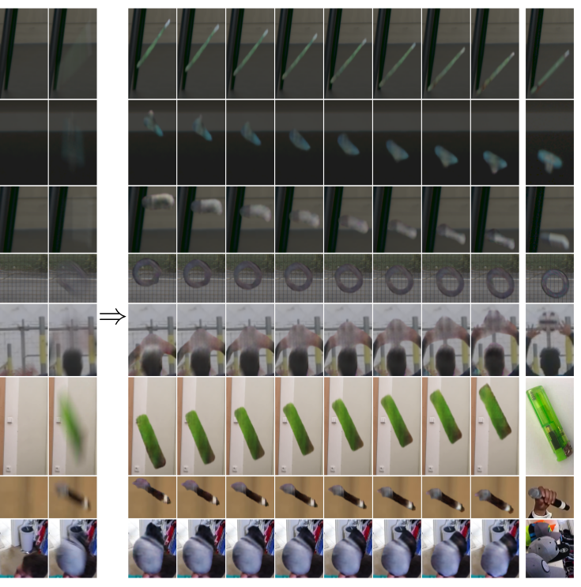

[](https://paperswithcode.com/sota/video-super-resolution-on-falling-objects?p=defmo-deblurring-and-shape-recovery-of-fast)
[](https://paperswithcode.com/sota/video-super-resolution-on-tbd-3d?p=defmo-deblurring-and-shape-recovery-of-fast)
[](https://paperswithcode.com/sota/video-super-resolution-on-tbd?p=defmo-deblurring-and-shape-recovery-of-fast)

# Evaluation, Training, Demo, and Inference of DeFMO 

### [DeFMO: Deblurring and Shape Recovery of Fast Moving Objects (CVPR 2021)](https://arxiv.org/abs/2012.00595)
#### Denys Rozumnyi, Martin R. Oswald, Vittorio Ferrari, Jiri Matas, Marc Pollefeys

### UPDATE
You can newly use DeFMO in [Kornia](https://kornia.readthedocs.io/en/latest/feature.html) (`kornia.feature.DeFMO`).  

### Qualitative results on [YouTube](https://www.youtube.com/watch?v=pmAynZvaaQ4)




### Pre-trained models

The pre-trained DeFMO model as reported in the paper is available [here](https://polybox.ethz.ch/index.php/s/M06QR8jHog9GAcF). Put the models into ./saved_models sub-folder.

### Inference
For generating video temporal super-resolution:
```bash
python run.py --video example/falling_pen.avi
```

For generating temporal super-resolution of a single frame with the given background:
```bash
python run.py --im example/im.png --bgr example/bgr.png
```

### Evaluation, benchmarking
Simple evaluation scripts for evaluation on [FMO deblurring benchmark](https://github.com/rozumden/fmo-deblurring-benchmark). You can download there all evaluation dataset: Falling Objects, TbD-3D, and TbD, which are also available [here](http://cmp.felk.cvut.cz/fmo/).


### Synthetic dataset generation
For the dataset generation, please download: 

* [ShapeNetCore.v2 dataset](https://www.shapenet.org/).

* Textures from the [DTD dataset](https://www.robots.ox.ac.uk/~vgg/data/dtd/). The exact split used in DeFMO is from the "Neural Voxel Renderer: Learning an Accurate and Controllable Rendering Tool" model and can be downloaded [here](https://polybox.ethz.ch/index.php/s/9Abv3QRm0ZgPzhK).

* Backgrounds for the training dataset from the [VOT dataset](https://www.votchallenge.net/vot2018/dataset.html). 

* Backgrounds for the testing dataset from the [Sports1M dataset](https://cs.stanford.edu/people/karpathy/deepvideo/).

* Blender 2.79b with Python enabled.

Then, insert your paths in renderer/settings.py file. To generate the dataset, run in renderer sub-folder: 
```bash
python run_render.py
```
Note that the full training dataset with 50 object categories, 1000 objects per category, and 24 timestamps takes 72 GB of storage memory. Due to this and also the ShapeNet licence, we cannot make the pre-generated dataset public - please generate it by yourself using the steps above. 

### Training
Set up all paths in main_settings.py and run
```bash
python train.py
```


Reference
------------
If you use this repository, please cite the following [publication](https://arxiv.org/abs/2012.00595):

```bibtex
@inproceedings{defmo,
  author = {Denys Rozumnyi and Martin R. Oswald and Vittorio Ferrari and Jiri Matas and Marc Pollefeys},
  title = {DeFMO: Deblurring and Shape Recovery of Fast Moving Objects},
  booktitle = {CVPR},
  address = {Nashville, Tennessee, USA},
  month = jun,
  year = {2021}
}
```
